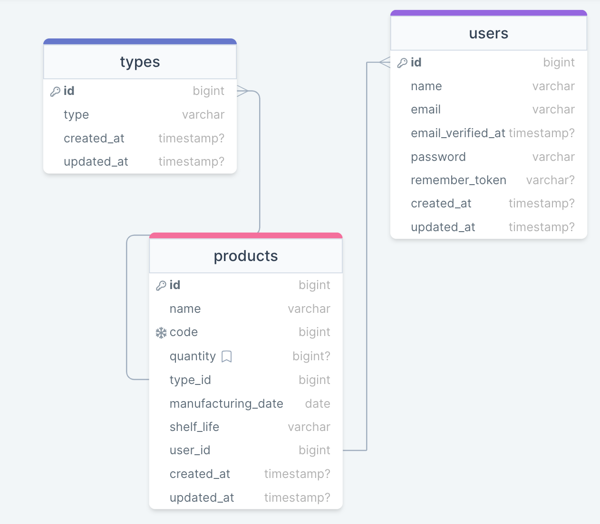

<div style="display:flex; align-items: center">
  <h1 style="position:relative; top: -6px" >Trading Network</h1>
</div>

---
Trading Network is an application where user can create products and view details about them via API. 

#
### Table of Contents
* [Prerequisites](#prerequisites)
* [Tech Stack](#tech-stack)
* [Getting Started](#getting-started)
* [Migrations](#migration)

#
### Prerequisites

*  *PHP*


#
### Tech Stack

*  [Laravel@10.x](https://laravel.com/docs/10.x) - back-end framework
*  [Sanctum Auth](https://laravel.com/docs/10.x/sanctum) - Stateful authentication system for SPA applications 

#
### Getting Started
First of all you need to clone E Space repository from github:
```sh
git clone https://github.com/AlexanderMtchedlidze/sweeft-project.git 
```

Next step requires you to run *composer install* in order to install all the dependencies.
```sh
composer install
```

Now we need to set our env file. Go to the root of your project and execute this command.
```sh
cp .env.example .env
```

#
**Database:**
> DB_USERNAME=root

> DB_PASSWORD=

after setting up **.env** file, execute:
```sh
php artisan config:cache
```
in order to cache environment variables.

Now execute in the root of you project following:
```sh
php artisan key:generate
```
Which generates auth key.

##### Now, you should be good to go!

#
### Migration
if you've completed getting started section, then migrating database if fairly simple process, just execute:

```sh
php artisan migrate --seed
```

#
### Development

You can run Laravel's built-in development server by executing:

```sh
php artisan serve
```

Then everything should be OK.

[Database Design Diagram](https://drawsql.app/teams/redberry-36/diagrams/trading-network)



